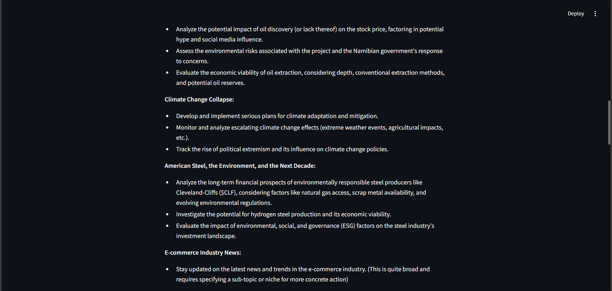

# City News Analyzer

## Overview

The **City News Analyzer** is a tool designed to analyze public discussions around trending news topics in a specific city. The tool gathers news topics, fetches related public discussions from Reddit, analyzes sentiments, and identifies actionable needs. The aim is to provide insights to political organizations, allowing them to better understand public opinion, sentiment, and demands for a given city.

## Task Breakdown

### Task 1: Gather Data

The first step in this project is to gather the top trending topics currently in the news for a given city.

#### Steps:
1. **Input**: The user provides the name of a city.
2. **News Source**: A news source (e.g., a popular news channel or API) is used to fetch the top news topics for the city.
3. **Display**: The top 5 trending topics are displayed for the user to review.

---

### Task 2: Gather Relevant Discussions

Once the topics are identified in **Task 1**, the next step is to gather relevant discussions around those topics.

#### Steps:
1. **Reddit API**: Use the Reddit API to search for posts related to each news topic from Task 1.
2. **Fetch Discussions**: Retrieve the most relevant Reddit discussions and comments associated with each topic.
3. **Organize Data**: For each discussion, collect:
   - The **title** of the Reddit post.
   - The **URL** of the post.
   - The **comments** made by users about the topic.

This step ensures that the tool gathers valuable, real-time public opinions and insights regarding the current news.

---

### Task 3: Analyze Gathered Information

In this task, the collected discussions from **Task 2** are analyzed to extract valuable insights.

#### Steps:
1. **Summarize Discussions**: Summarize the key points and recurring themes from the discussions across different posts.
2. **Sentiment Analysis**: Determine the sentiment of the discussions (e.g., positive, negative, or neutral).
3. **Identify Actionable Needs**: Extract actionable needs or demands expressed by the participants, such as calls for action, policy suggestions, or concerns.

This analysis will help understand public sentiment and highlight potential actions based on the discussions.

---

### Task 4: Build a Front-End Interface

The final task is to create a simple front-end web interface that allows users to interact with the system.

#### Features:
- **Input Fields**: Users can input a city name and select discussion platforms (e.g., Reddit).
- **Results Display**: After fetching and analyzing the data, the results are displayed on the front-end, including:
  - **Summary** of the discussions.
  - **Sentiment Analysis** of the discussions.
  - **Actionable Needs** that people are demanding.
  
The interface will provide a clear, concise presentation of the analyzed results, making it easy for users (such as political organizations) to interpret the information.

---

## Technologies Used

- **Reddit API**: To gather discussions and comments related to the trending news topics.
- **Natural Language Processing (NLP)**: For sentiment analysis and summarization of discussions.
- **Streamlit**: For creating the simple web interface that displays the results to the user.
- **Python**: The primary programming language used to implement the backend and analysis functionalities.

---

### Example Results

Here are some screenshots showing the results after analyzing discussions:


The sentiment analysis indicates that people are largely dissatisfied with recent political events in the city.




This chart summarizes the key highlights of the discussions, including the most frequently mentioned topics and concerns.

---

## Installation

### Prerequisites

1. **Python 3.8+**
2. **API Keys**: You'll need to create and configure API keys for Reddit and any news sources used in the project.

### Setup

1. Clone the repository:

   ```bash
   git clone https://github.com/yourusername/city-news-analyzer.git
    ```

2. Install the required dependencies:
   ```bash
   pip install -r requirements.txt
    ```

3. Set up your API keys for Reddit and other sources. You can configure them in a config.py file.

4. Run the application
   ```bash
   streamlit run controller.py
   ```